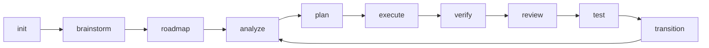

<div align="center">

# Maestro

### AI Workflow Orchestration Platform

**Coordinate Claude, Codex, and Gemini agents through structured workflows — from brainstorm to production.**

[](https://www.typescriptlang.org/)
[](https://nodejs.org/)
[](https://modelcontextprotocol.io/)
[](LICENSE)

---

**Maestro** is a workflow orchestration platform that turns AI coding agents into a coordinated development team. It provides structured pipelines, a real-time Kanban dashboard, and an autonomous Commander Agent that drives multi-agent collaboration from project inception to delivery.

[Getting Started](#getting-started) | [Dashboard](#dashboard) | [Workflow Pipelines](#workflow-pipelines) | [Issue Closed-Loop](#issue-closed-loop-system) | [Architecture](#architecture)

</div>

---

## Why Maestro?

Modern AI coding assistants (Claude, Codex, Gemini) are powerful individually — but coordinating them across complex, multi-phase projects is a manual bottleneck. Maestro solves this:

- **Structured Pipelines** — Define project phases (init → roadmap → analyze → plan → execute → verify → test) with explicit state transitions and quality gates
- **Multi-Agent Orchestration** — Route tasks to the right agent (Claude for architecture, Codex for implementation, Gemini for analysis) with parallel execution and dependency management
- **Real-Time Dashboard** — Linear-style Kanban board with 4 views, live execution monitoring, and one-click agent dispatch
- **Autonomous Commander** — AI supervisor that continuously assesses project state, detects Issues, and auto-dispatches agents to maintain forward progress
- **Issue Closed-Loop** — Discover → Analyze → Plan → Execute pipeline that transforms code problems into verified fixes without manual intervention

## Key Features

### Multi-Agent Execution Engine

```
                    ┌─────────────────────────────┐
                    │     ExecutionScheduler       │
                    │  (wave-based parallel exec)  │
                    └──────────┬──────────────────┘
                               │
              ┌────────────────┼────────────────┐
              │                │                │
        ┌─────┴─────┐  ┌──────┴─────┐  ┌──────┴──────┐
        │  Claude    │  │   Codex    │  │   Gemini    │
        │  (Agent    │  │   (CLI     │  │   (CLI      │
        │   SDK)     │  │   Adapter) │  │   Adapter)  │
        └───────────┘  └────────────┘  └─────────────┘
```

- **Agent SDK integration** — Native Claude Agent SDK for Claude Code, CLI adapters for Codex and Gemini
- **Wave execution** — Independent tasks run in parallel, dependent tasks follow topological order
- **Agent Manager** — Unified spawn/stop/stream interface across all agent types
- **Workspace isolation** — Each execution gets a clean working context

### 36 Slash Commands in 4 Categories

| Category | Commands | Purpose |
|----------|----------|---------|
| `maestro-*` | 15 commands | Full lifecycle: init, brainstorm, roadmap, analyze, plan, execute, verify, phase-transition |
| `manage-*` | 9 commands | Issue CRUD, discovery, analysis, planning, execution, codebase docs, memory |
| `quality-*` | 7 commands | Review, test, debug, test-gen, integration-test, refactor, sync |
| `spec-*` | 4 commands | Specification setup, add, load, map |

### 21 Specialized Agents

Agents in `.claude/agents/` handle specific roles — from `workflow-planner` and `workflow-executor` to `issue-discover-agent`, `workflow-debugger`, and `team-worker`. Each agent is a focused Markdown definition that Claude Code loads on demand.

---

## Dashboard

A Linear-inspired real-time dashboard at `http://127.0.0.1:3001` with WebSocket live updates.

### 4 Kanban Views

| View | Key | Description |
|------|-----|-------------|
| **Board** | `K` | Kanban columns: Backlog → In Progress → Review → Done. Phase cards + Issue cards + Linear integration |
| **Timeline** | `T` | Gantt-style phase timeline with progress indicators |
| **Table** | `L` | Sortable tabular view with all phase/issue metadata |
| **Center** | `C` | Command center — active executions, issue queue, quality summary |

### Dashboard Capabilities

- **One-click execution** — Select agent (Claude/Codex/Gemini) and hit play on any Issue card
- **Batch operations** — Multi-select Issues for parallel dispatch
- **Live CLI panel** — Real-time streaming output from running agents
- **Issue lifecycle** — Create, analyze, plan, execute Issues directly from the board
- **Commander status bar** — See autonomous supervisor state, action queue, execution slots
- **Linear sync** — Import/export Issues to Linear for team collaboration

### Commander Agent (Autonomous Supervisor)

The Commander Agent runs a continuous **tick loop**:

```
assess → decide → dispatch → (wait) → assess → ...
```

- **Assess** — Reads all phases, tasks, Issues, execution slots
- **Decide** — Generates prioritized action list based on configurable rules
- **Dispatch** — Routes to `ExecutionScheduler` (code tasks) or `AgentManager` (analysis/planning)
- **Profiles** — `conservative`, `balanced`, `aggressive` control dispatch cadence

---

## Workflow Pipelines

### Phase Pipeline (Main Track)



Each phase has explicit status (`pending → exploring → planning → executing → verifying → testing → completed`) and the dashboard shows the recommended next command at each step.

### Quick Channels

| Channel | Flow | Use Case |
|---------|------|----------|
| `/maestro-quick` | analyze → plan → execute (single task) | Quick fixes, small features |
| Scratch mode | `analyze -q` → `plan --dir` → `execute --dir` | No roadmap needed |
| `/maestro "intent"` | AI routes to optimal command chain | Natural language dispatch |

### Issue Closed-Loop System

Issues flow through a fully automated lifecycle:


| Stage | Command | What Happens |
|-------|---------|-------------|
| **Discover** | `/manage-issue-discover` | 8-perspective scan finds bugs, UX issues, tech debt, security gaps |
| **Analyze** | `/manage-issue-analyze` | Root cause analysis with CLI exploration, writes `analysis` field |
| **Plan** | `/manage-issue-plan` | Generates executable solution steps with file targets and verification criteria |
| **Execute** | `/manage-issue-execute` | Dual-mode dispatch — Dashboard API when server is up, direct CLI when offline |
| **Close** | Automatic | Status transitions to `resolved` → `closed` after verification |

The Commander Agent can drive this entire loop autonomously — discovering Issues from quality gaps, analyzing them, planning fixes, and dispatching execution agents.

---

## Getting Started

### Prerequisites

- Node.js >= 18
- [Claude Code](https://claude.com/code) CLI installed
- (Optional) Codex CLI, Gemini CLI for multi-agent workflows

### Installation

```bash
# Clone and install
git clone <repo-url> maestro
cd maestro
npm install

# Build
npm run build

# Install globally (optional)
npm link
```

### Quick Start

```bash
# 1. Start the dashboard
cd dashboard && npm install && npm run dev
# → Open http://127.0.0.1:3001

# 2. Initialize a project (in Claude Code)
/maestro-init

# 3. Create roadmap
/maestro-roadmap

# 4. Start Phase 1
/maestro-plan 1

# 5. Or just tell Maestro what to do
/maestro "implement user authentication with OAuth2"
```

### MCP Server

Maestro exposes tools via the Model Context Protocol for integration with Claude Desktop and other MCP clients:

```bash
npm run mcp  # Start MCP server (stdio transport)
```

---

## Architecture

```
maestro/
├── bin/                     # CLI entry points
├── src/                     # Core CLI (Commander.js + MCP SDK)
│   ├── commands/            # 11 CLI commands (serve, run, cli, ext, tool, ...)
│   ├── mcp/                 # MCP server (stdio transport)
│   └── core/                # Tool registry, extension loader
├── dashboard/               # React + Hono real-time dashboard
│   └── src/
│       ├── client/          # React 19 + Zustand + Tailwind CSS 4
│       │   ├── components/
│       │   │   └── kanban/  # 19 Kanban components (Board, Cards, Modals, ...)
│       │   ├── pages/       # 6 pages (Kanban, Workflow, Specs, Artifacts, MCP)
│       │   └── store/       # 5 Zustand stores (board, issue, execution, linear, ui-prefs)
│       ├── server/          # Hono API + WebSocket + SSE
│       │   ├── agents/      # Multi-agent adapters (Claude SDK, Codex CLI, OpenCode)
│       │   ├── commander/   # Autonomous Commander Agent
│       │   ├── execution/   # ExecutionScheduler + WaveExecutor + WorkspaceManager
│       │   └── routes/      # 14 API route modules
│       └── shared/          # Types shared between client and server
├── .claude/
│   ├── commands/            # 36 slash commands (.md)
│   └── agents/              # 21 agent definitions (.md)
├── workflows/               # 36 workflow implementations (.md)
├── templates/               # JSON templates (task, plan, issue, ...)
└── extensions/              # Plugin system
```

### Tech Stack

| Layer | Technology |
|-------|-----------|
| **CLI** | Commander.js, TypeScript, ESM |
| **MCP** | @modelcontextprotocol/sdk (stdio transport) |
| **Dashboard Frontend** | React 19, Zustand, Tailwind CSS 4, Framer Motion, Radix UI |
| **Dashboard Backend** | Hono, WebSocket (ws), Server-Sent Events |
| **Agent Integration** | Claude Agent SDK, Codex CLI, Gemini CLI, OpenCode |
| **Build** | Vite 6, TypeScript 5.7, Vitest |

### Extension System

Maestro supports plugins loaded from `~/.maestro/extensions/` or local `extensions/`:

```typescript
// extensions/my-tool/index.ts
export default {
  name: 'my-tool',
  tools: [{ name: 'custom-analysis', handler: async (input) => { /* ... */ } }]
};
```

---

## Documentation

| Document | Description |
|----------|-------------|
| [Command Usage Guide](docs/command-usage-guide.md) | Complete guide to all 36 commands with workflow diagrams |
| [Issue-Kanban Integration](docs/issue-kanban-integration.md) | Data model, lifecycle, UI, API, WebSocket, Commander automation |
| [Fusion Architecture](docs/fusion-design.md) | System design document (`.workflow/` directory, schemas, principles) |
| [GSD Architecture Reference](docs/gsd-architecture-reference.md) | Original architecture reference |

## License

MIT
