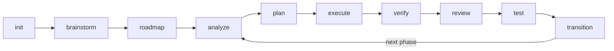
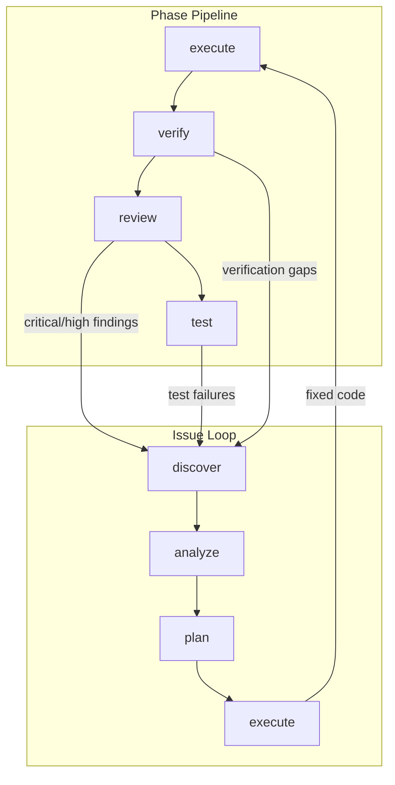

<div align="center">

# Maestro-Flow

### Multi-Agent Workflow Orchestration for Claude Code & Codex

**One command. Multiple AI agents. Structured delivery.**

[](https://www.typescriptlang.org/)
[](https://nodejs.org/)
[](https://modelcontextprotocol.io/)
[](LICENSE)

[English](README.md) | [简体中文](README.zh-CN.md)

---

*I don't write code — Claude Code and Codex do. But telling them what to do, in what order, with what context, and verifying the result — that's where all the time goes. Maestro-Flow makes that orchestration automatic.*

</div>

---

## Background

This project is a **ground-up rewrite** of [Claude-Code-Workflow (CCW)](https://github.com/catlog22/Claude-Code-Workflow), my earlier multi-CLI orchestration framework. CCW proved that coordinating Claude, Codex, Gemini and other AI agents through structured workflows is powerful — but it grew complex. Too many layers, too many abstractions.

Maestro-Flow takes the core ideas that worked and rebuilds them with a clear philosophy: **less ceremony, faster execution.** The spec-driven phase pipeline is inspired by [GET SHIT DONE (GSD)](https://github.com/gsd-build/get-shit-done) — its context engineering approach and atomic commit discipline are genuinely elegant. Maestro-Flow adopts those design patterns while adding what GSD doesn't have: a real-time visual dashboard, multi-agent execution with Claude Agent SDK, and an autonomous Commander that keeps the pipeline moving without you.

**What changed from CCW:**
- Stripped the heavy session/beat orchestration layer — replaced with lightweight skill-based routing
- Merged the terminal dashboard into a proper web UI with Linear-style Kanban
- Unified CLI tool invocation through a single `ccw cli` interface
- Added autonomous Commander Agent (assess → decide → dispatch loop)
- Built a complete Issue closed-loop system (discover → analyze → plan → execute → close)

**What we kept:**
- Multi-CLI orchestration (Claude, Codex, Gemini, Qwen, OpenCode)
- Structured workflows as Markdown definitions
- Slash commands as the user interface
- Agent definitions as focused role specifications

---

## What It Does

You describe what you want. Maestro-Flow figures out which agents to use, in what order, with what context — and drives it to completion.

```bash
# Natural language — Maestro-Flow routes to the optimal command chain
/maestro "implement OAuth2 authentication with refresh tokens"

# Or step by step
/maestro-init                    # Set up project workspace
/maestro-roadmap                 # Create phased roadmap interactively
/maestro-plan 1                  # Generate execution plan for Phase 1
/maestro-execute 1               # Wave-based parallel agent execution
/maestro-verify 1                # Goal-backward verification
```

### The Pipeline



Each phase has explicit status tracking. The dashboard shows what's happening and what to do next.

### Quick Channels

Not everything needs a full pipeline:

| Channel | Flow | When |
|---------|------|------|
| `/maestro-quick` | analyze → plan → execute | Quick fixes, small features |
| Scratch mode | `analyze -q` → `plan --dir` → `execute --dir` | No roadmap, just get it done |
| `/maestro "..."` | AI-routed command chain | Describe intent, let Maestro-Flow decide |

---

## The Dashboard

A real-time project control panel at `http://127.0.0.1:3001`. Built with React 19, Tailwind CSS 4, and WebSocket live updates.

### Four Views

| View | Key | What You See |
|------|-----|-------------|
| **Board** | `K` | Kanban columns — Backlog, In Progress, Review, Done. Phase cards and Issue cards side by side. |
| **Timeline** | `T` | Gantt-style phase timeline with progress bars |
| **Table** | `L` | Every phase and issue in a sortable table |
| **Center** | `C` | Command center — active executions, issue queue, quality metrics |

### What You Can Do

- **Pick an agent, hit play** — Select Claude / Codex / Gemini on any Issue card, click execute
- **Batch dispatch** — Multi-select Issues, send them all to agents in parallel
- **Watch agents work** — Real-time CLI output streaming panel
- **Full Issue lifecycle** — Create, analyze, plan, execute, close — all from the board
- **Linear sync** — Import/export Issues to Linear for team workflows

### Commander Agent

The autonomous supervisor. Runs a tick loop in the background:

```
assess → decide → dispatch → wait → assess → ...
```

It reads project state (phases, tasks, Issues, agent slots), decides what needs attention, and dispatches agents automatically. Three profiles: `conservative`, `balanced`, `aggressive`.

When the Commander is on, Issues flow from discovery to resolution without manual intervention.

---

## Issue Closed-Loop

Issues aren't just tickets — they're a self-healing pipeline:


| Stage | Command | What Happens |
|-------|---------|-------------|
| **Discover** | `/manage-issue-discover` | 8-perspective scan: bugs, UX, tech debt, security, performance, testing gaps, code quality, documentation |
| **Analyze** | `/manage-issue-analyze` | Root cause analysis via CLI exploration. Writes structured `analysis` to the Issue. |
| **Plan** | `/manage-issue-plan` | Generates solution steps — target files, code changes, verification criteria |
| **Execute** | `/manage-issue-execute` | Dual-mode: Dashboard API dispatch when server is up, direct CLI execution when offline |
| **Close** | Automatic | Verification passes → `resolved` → `closed` |

### How Issues Connect to the Pipeline



Quality commands (`review`, `test`, `verify`) automatically create Issues for problems they find. Issue fixes flow back into the phase. The loop closes itself.

---

## Multi-Agent Execution

Maestro-Flow doesn't pick one AI — it uses them together:

```
              ┌────────────────────────────────┐
              │      ExecutionScheduler         │
              │   (wave-based parallel engine)  │
              └───────────┬────────────────────┘
                          │
           ┌──────────────┼──────────────┐
           │              │              │
     ┌─────┴─────┐ ┌─────┴──────┐ ┌────┴──────┐
     │  Claude    │ │   Codex    │ │  Gemini   │
     │ Agent SDK  │ │  CLI       │ │  CLI      │
     └───────────┘ └────────────┘ └───────────┘
```

- **Wave execution** — Independent tasks run in parallel across agents, dependent tasks wait for predecessors
- **Agent SDK** — Native Claude Agent SDK for Claude Code processes
- **CLI adapters** — Codex, Gemini, Qwen, OpenCode all accessible through `ccw cli`
- **Workspace isolation** — Each agent gets a clean execution context

---

## 36 Commands, 21 Agents

### Commands (Slash Commands for Claude Code)

| Category | Count | Purpose |
|----------|-------|---------|
| `maestro-*` | 15 | Full lifecycle — init, brainstorm, roadmap, analyze, plan, execute, verify, phase-transition |
| `manage-*` | 9 | Issue CRUD, discovery, analysis, planning, execution, codebase docs, memory |
| `quality-*` | 7 | Review, test, debug, test-gen, integration-test, refactor, sync |
| `spec-*` | 4 | Specification setup, add, load, map |

### Agents

21 specialized agent definitions in `.claude/agents/` — each a focused Markdown file that Claude Code loads on demand. Includes `workflow-planner`, `workflow-executor`, `issue-discover-agent`, `workflow-debugger`, `workflow-verifier`, `team-worker`, and more.

---

## Getting Started

### Prerequisites

- Node.js >= 18
- [Claude Code](https://claude.com/code) CLI
- (Optional) Codex CLI, Gemini CLI for multi-agent workflows

### Install

```bash
git clone https://github.com/catlog22/Maestro-Flow.git
cd Maestro-Flow
npm install && npm run build

# Dashboard
cd dashboard && npm install && npm run dev
# → http://127.0.0.1:3001
```

### First Run

```bash
/maestro-init                  # Initialize project
/maestro-roadmap               # Create roadmap
/maestro-plan 1                # Plan Phase 1
/maestro-execute 1             # Execute with agents

# Or just:
/maestro "build a REST API for user management"
```

### MCP Server

Expose Maestro-Flow tools to Claude Desktop and other MCP clients:

```bash
npm run mcp  # stdio transport
```

---

## Architecture

```
maestro/
├── bin/                     # CLI entry points
├── src/                     # Core CLI (Commander.js + MCP SDK)
│   ├── commands/            # 11 CLI commands (serve, run, cli, ext, tool, ...)
│   ├── mcp/                 # MCP server (stdio transport)
│   └── core/                # Tool registry, extension loader
├── dashboard/               # Real-time web dashboard
│   └── src/
│       ├── client/          # React 19 + Zustand + Tailwind CSS 4
│       │   └── components/
│       │       └── kanban/  # 19 Kanban components
│       ├── server/          # Hono API + WebSocket + SSE
│       │   ├── agents/      # AgentManager + adapters (Claude SDK, Codex CLI, OpenCode)
│       │   ├── commander/   # Autonomous Commander Agent
│       │   └── execution/   # ExecutionScheduler + WaveExecutor
│       └── shared/          # Shared types
├── .claude/
│   ├── commands/            # 36 slash commands (.md)
│   └── agents/              # 21 agent definitions (.md)
├── workflows/               # 36 workflow implementations (.md)
├── templates/               # JSON templates (task, plan, issue, ...)
└── extensions/              # Plugin system
```

### Tech Stack

| Layer | Technology |
|-------|-----------|
| CLI | Commander.js, TypeScript, ESM |
| MCP | @modelcontextprotocol/sdk (stdio) |
| Frontend | React 19, Zustand, Tailwind CSS 4, Framer Motion, Radix UI |
| Backend | Hono, WebSocket, SSE |
| Agents | Claude Agent SDK, Codex CLI, Gemini CLI, OpenCode |
| Build | Vite 6, TypeScript 5.7, Vitest |

---

## Documentation

- **[Command Usage Guide](guide/command-usage-guide.md)** — All 36 commands with workflow diagrams, pipeline chaining, Issue closed-loop, and quick channels

---

## Acknowledgments

Maestro-Flow stands on the shoulders of two projects:

- **[GET SHIT DONE](https://github.com/gsd-build/get-shit-done)** by TACHES — The spec-driven development model, context engineering philosophy, and atomic commit discipline that shaped Maestro-Flow's pipeline design. GSD proved that structured meta-prompting is the right way to drive AI agents at scale.

- **[Claude-Code-Workflow](https://github.com/catlog22/Claude-Code-Workflow)** — The predecessor to Maestro-Flow. CCW pioneered multi-CLI orchestration (Gemini + Codex + Qwen + Claude), skill-based workflow routing, and team agent architecture. Maestro-Flow is CCW rebuilt from scratch — faster, leaner, with a visual dashboard and autonomous commander.

## Contributors

<a href="https://github.com/catlog22">
  
</a>

**[@catlog22](https://github.com/catlog22)** — Creator & Maintainer

## License

MIT
