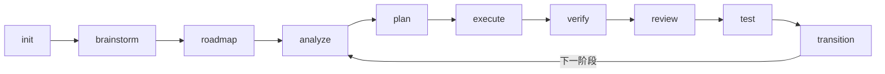
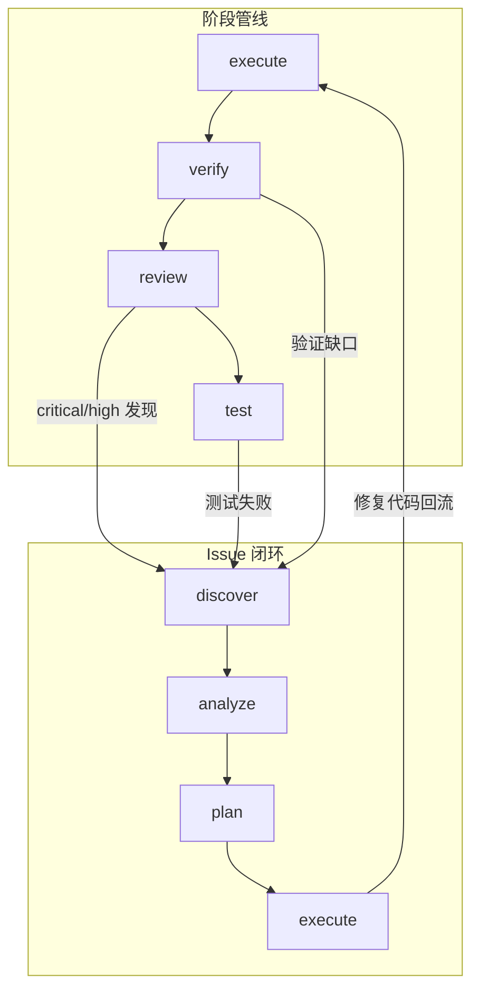

<div align="center">

# Maestro-Flow

### 面向 Claude Code & Codex 的多智能体工作流编排

**一条命令，多个 AI 智能体，结构化交付。**

[](https://www.typescriptlang.org/)
[](https://nodejs.org/)
[](https://modelcontextprotocol.io/)
[](LICENSE)

[English](README.md) | [简体中文](README.zh-CN.md)

---

*我不写代码 —— Claude Code 和 Codex 写。但告诉它们做什么、按什么顺序、带什么上下文、然后验证结果 —— 这才是耗时间的地方。Maestro-Flow 把这些编排自动化了。*

</div>

---

## 背景

这个项目是 [Claude-Code-Workflow (CCW)](https://github.com/catlog22/Claude-Code-Workflow) 的**彻底重写**。CCW 是我之前的多 CLI 编排框架，它证明了通过结构化工作流协调 Claude、Codex、Gemini 等 AI 智能体是可行的 —— 但它越长越复杂。太多层级，太多抽象。

Maestro-Flow 保留了验证过的核心思路，用全新的理念重建：**更少仪式感，更快执行。** 规格驱动的阶段管线设计受 [GET SHIT DONE (GSD)](https://github.com/gsd-build/get-shit-done) 启发 —— 它的上下文工程方法和原子提交纪律确实优雅。Maestro-Flow 采纳了这些设计模式，同时补上 GSD 没有的东西：实时可视化看板、基于 Claude Agent SDK 的多智能体执行、以及自主运行的 Commander 让管线持续推进。

**相比 CCW 改了什么：**
- 砍掉了重型的 session/beat 编排层 —— 替换为轻量的 skill 路由
- 终端仪表盘升级为 Linear 风格的 Web 看板 UI
- 统一所有 CLI 工具调用到 `maestro cli` 单一接口
- 新增自主 Commander Agent（assess → decide → dispatch 循环）
- 构建了完整的 Issue 闭环系统（discover → analyze → plan → execute → close）

**保留了什么：**
- 多 CLI 编排（Claude、Codex、Gemini、Qwen、OpenCode）
- Markdown 定义的结构化工作流
- 斜杠命令作为用户界面
- Agent 定义作为聚焦的角色规格

---

## 它做什么

你描述你想要什么。Maestro-Flow 决定用哪些智能体、按什么顺序、带什么上下文 —— 然后驱动它完成。

```bash
# 自然语言 —— Maestro-Flow 路由到最优命令链
/maestro "实现基于 OAuth2 的用户认证，带 refresh token"

# 或者一步步来
/maestro-init                    # 初始化项目工作区
/maestro-roadmap                 # 交互式创建路线图
/maestro-plan 1                  # 生成第一阶段执行计划
/maestro-execute 1               # 波次并行多智能体执行
/maestro-verify 1                # 目标反推验证
```

### 阶段管线



每个阶段有明确的状态跟踪。仪表盘展示正在发生什么、下一步该做什么。

### 快速通道

不是所有事情都需要走完整管线：

| 通道 | 流程 | 适用场景 |
|------|------|---------|
| `/maestro-quick` | analyze → plan → execute | 快速修复、小功能 |
| Scratch 模式 | `analyze -q` → `plan --dir` → `execute --dir` | 不需要 roadmap，直接干 |
| `/maestro "..."` | AI 路由命令链 | 描述意图，让 Maestro-Flow 决定 |

---

## 看板仪表盘

实时项目控制面板，运行在 `http://127.0.0.1:3001`。React 19 + Tailwind CSS 4 构建，WebSocket 实时更新。

### 四种视图

| 视图 | 快捷键 | 你看到什么 |
|------|--------|-----------|
| **Board** | `K` | 看板列 —— Backlog、In Progress、Review、Done。Phase 卡片和 Issue 卡片并排展示。 |
| **Timeline** | `T` | 甘特图风格的阶段时间线，带进度条 |
| **Table** | `L` | 所有阶段和 Issue 的可排序表格 |
| **Center** | `C` | 指挥中心 —— 活跃执行、Issue 队列、质量指标 |

### 你能做什么

- **选个智能体，点播放** — 在 Issue 卡片上选 Claude / Codex / Gemini，点执行
- **批量派发** — 多选 Issue，并行发送给智能体
- **看智能体工作** — 实时 CLI 输出流式面板
- **Issue 全生命周期** — 创建、分析、规划、执行、关闭 —— 全在看板上
- **Linear 同步** — 导入/导出 Issue 到 Linear，支持团队协作

### Commander Agent

自主监督者。后台运行 tick 循环：

```
评估(assess) → 决策(decide) → 派发(dispatch) → 等待 → 评估 → ...
```

它读取项目状态（阶段、任务、Issue、智能体工位），判断什么需要处理，自动派发智能体。三档配置：`conservative`、`balanced`、`aggressive`。

Commander 开启后，Issue 从发现到解决全程无需人工干预。

---

## Issue 闭环

Issue 不只是工单 —— 它们是一条自修复管线：


| 阶段 | 命令 | 做了什么 |
|------|------|---------|
| **发现** | `/manage-issue-discover` | 8 视角扫描：Bug、UX、技术债、安全、性能、测试缺口、代码质量、文档 |
| **分析** | `/manage-issue-analyze` | CLI 探索式根因分析，将结构化 `analysis` 写入 Issue |
| **规划** | `/manage-issue-plan` | 生成解决方案步骤 —— 目标文件、代码变更、验证条件 |
| **执行** | `/manage-issue-execute` | 双模式：服务器在线走 Dashboard API 派发，离线走 CLI 直接执行 |
| **关闭** | 自动 | 验证通过 → `resolved` → `closed` |

### Issue 如何连接主干管线



质量命令（`review`、`test`、`verify`）自动为发现的问题创建 Issue。Issue 修复的代码回流到阶段。闭环自动关闭。

---

## 多智能体执行

Maestro-Flow 不挑一个 AI —— 它让它们一起干：

```
              ┌────────────────────────────────┐
              │      ExecutionScheduler         │
              │     （波次并行执行引擎）          │
              └───────────┬────────────────────┘
                          │
           ┌──────────────┼──────────────┐
           │              │              │
     ┌─────┴─────┐ ┌─────┴──────┐ ┌────┴──────┐
     │  Claude    │ │   Codex    │ │  Gemini   │
     │ Agent SDK  │ │  CLI       │ │  CLI      │
     └───────────┘ └────────────┘ └───────────┘
```

- **波次执行** — 无依赖任务跨智能体并行，有依赖任务等前置完成
- **Agent SDK** — 原生 Claude Agent SDK 驱动 Claude Code 进程
- **CLI 适配器** — Codex、Gemini、Qwen、OpenCode 全部通过 `maestro cli` 调用
- **工作区隔离** — 每个智能体获得独立执行上下文

---

## 命令 Overlay 系统

非侵入式地为 `.claude/commands/*.md` 文件打补丁 —— 增加步骤、阅读要求、质量门禁 —— 无需编辑原始文件。Overlay 在 `maestro install` 升级后自动重新应用。

```bash
# 自然语言创建
/maestro-overlay "在 maestro-execute 执行后增加 CLI 验证"

# 手动操作
maestro overlay add my-overlay.json    # 安装 + 应用
maestro overlay list                   # 交互式 TUI 管理
maestro overlay bundle -o team.json    # 打包分享
maestro overlay import-bundle team.json # 解包 + 应用
```

每个 overlay 声明目标命令和补丁列表（section + mode + content）。Patcher 使用哈希 HTML 注释标记包裹注入内容，实现幂等应用和精准移除。

详见 **[Overlay 系统指南](guide/overlay-guide.md)**。

---

## 36 个命令，21 个 Agent

### 命令（Claude Code 斜杠命令）

| 类别 | 数量 | 用途 |
|------|------|------|
| `maestro-*` | 15 | 全生命周期 — init、brainstorm、roadmap、analyze、plan、execute、verify、phase-transition |
| `manage-*` | 9 | Issue CRUD、发现、分析、规划、执行、代码库文档、记忆管理 |
| `quality-*` | 7 | review、test、debug、test-gen、integration-test、refactor、sync |
| `spec-*` | 4 | 规格说明 — setup、add、load、map |

### Agent

`.claude/agents/` 下 21 个专业化 Agent 定义 —— 每个是聚焦的 Markdown 文件，Claude Code 按需加载。包括 `workflow-planner`、`workflow-executor`、`issue-discover-agent`、`workflow-debugger`、`workflow-verifier`、`team-worker` 等。

---

## 快速开始

### 前置条件

- Node.js >= 18
- [Claude Code](https://claude.com/code) CLI
- （可选）Codex CLI、Gemini CLI 用于多智能体工作流

### 安装

#### npm（推荐）

```bash
npm install -g maestro-flow

# 安装 workflows、commands、agents、templates
maestro install
```

#### 从源码编译

```bash
git clone https://github.com/catlog22/Maestro-Flow.git
cd Maestro-Flow
npm install && npm run build && npm install -g .
maestro install
```

#### 启动仪表盘

```bash
cd dashboard && npm install && npm run dev
# → http://127.0.0.1:3001
```

### 第一次运行

```bash
/maestro-init                  # 初始化项目
/maestro-roadmap               # 创建路线图
/maestro-plan 1                # 规划第一阶段
/maestro-execute 1             # 多智能体执行

# 或者直接：
/maestro "搭建用户管理的 REST API"
```

### MCP 服务器

将 Maestro-Flow 工具暴露给 Claude Desktop 和其他 MCP 客户端：

```bash
npm run mcp  # stdio 传输
```

---

## 架构

```
maestro/
├── bin/                     # CLI 入口
├── src/                     # 核心 CLI（Commander.js + MCP SDK）
│   ├── commands/            # 11 个 CLI 命令（serve, run, cli, ext, tool, ...）
│   ├── mcp/                 # MCP 服务器（stdio 传输）
│   └── core/                # 工具注册、扩展加载器
├── dashboard/               # 实时 Web 仪表盘
│   └── src/
│       ├── client/          # React 19 + Zustand + Tailwind CSS 4
│       │   └── components/
│       │       └── kanban/  # 19 个看板组件
│       ├── server/          # Hono API + WebSocket + SSE
│       │   ├── agents/      # AgentManager + 适配器（Claude SDK, Codex CLI, OpenCode）
│       │   ├── commander/   # 自主 Commander Agent
│       │   └── execution/   # ExecutionScheduler + WaveExecutor
│       └── shared/          # 共享类型
├── .claude/
│   ├── commands/            # 36 个斜杠命令（.md）
│   └── agents/              # 21 个 Agent 定义（.md）
├── workflows/               # 36 个工作流实现（.md）
├── templates/               # JSON 模板（task, plan, issue, ...）
└── extensions/              # 插件系统
```

### 技术栈

| 层级 | 技术 |
|------|------|
| CLI | Commander.js, TypeScript, ESM |
| MCP | @modelcontextprotocol/sdk（stdio） |
| 前端 | React 19, Zustand, Tailwind CSS 4, Framer Motion, Radix UI |
| 后端 | Hono, WebSocket, SSE |
| 智能体 | Claude Agent SDK, Codex CLI, Gemini CLI, OpenCode |
| 构建 | Vite 6, TypeScript 5.7, Vitest |

---

## 文档

- **[命令使用指南](guide/command-usage-guide.md)** — 全部 36 个命令，含工作流图表、管线衔接、Issue 闭环、快速通道
- **[Overlay 系统指南](guide/overlay-guide.md)** — 非侵入式命令扩展：overlay 格式、section 注入、bundle 打包/导入、交互式 TUI 管理
- **[Team Lite — 使用指南](guide/team-lite-guide.md)** — 2-8 人小团队日常协作：加入、同步、队友活跃、冲突预飞检

---

## 致谢

Maestro-Flow 站在两个项目的肩膀上：

- **[GET SHIT DONE](https://github.com/gsd-build/get-shit-done)** by TACHES — 规格驱动开发模型、上下文工程理念、原子提交纪律，塑造了 Maestro-Flow 的管线设计。GSD 证明了结构化的 meta-prompting 才是大规模驱动 AI 智能体的正确方式。

- **[Claude-Code-Workflow](https://github.com/catlog22/Claude-Code-Workflow)** — Maestro-Flow 的前身。CCW 开创了多 CLI 编排（Gemini + Codex + Qwen + Claude）、skill 路由工作流、team agent 架构。Maestro-Flow 是 CCW 从零重建 —— 更快、更精简，加上可视化看板和自主 Commander。

## 贡献者

<a href="https://github.com/catlog22">
  
</a>

**[@catlog22](https://github.com/catlog22)** — 创建者 & 维护者

## 友情链接

- [Linux DO：学AI，上L站！](https://linux.do/)

## 许可证

MIT
