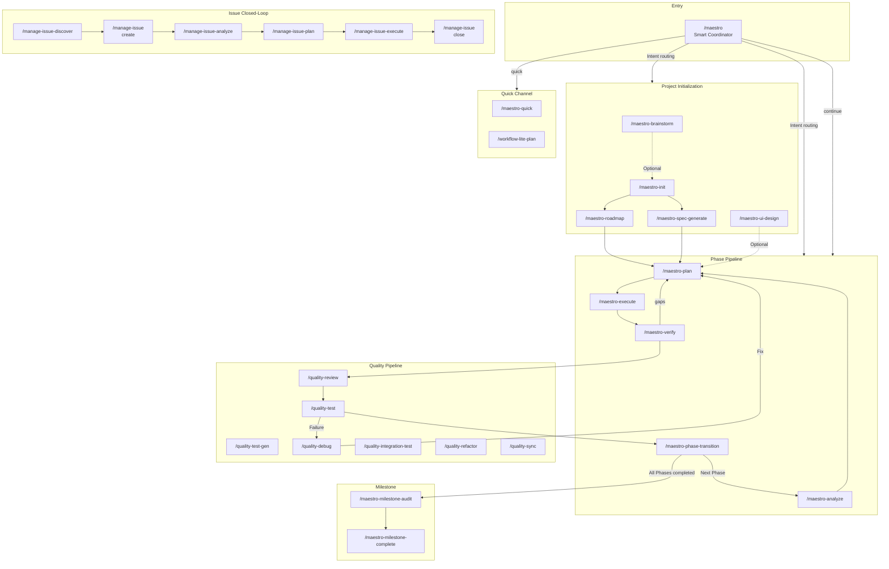
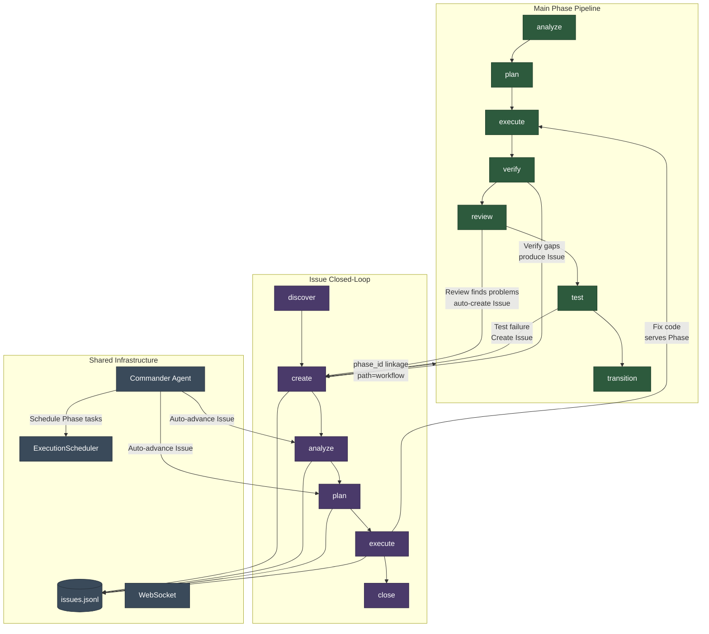
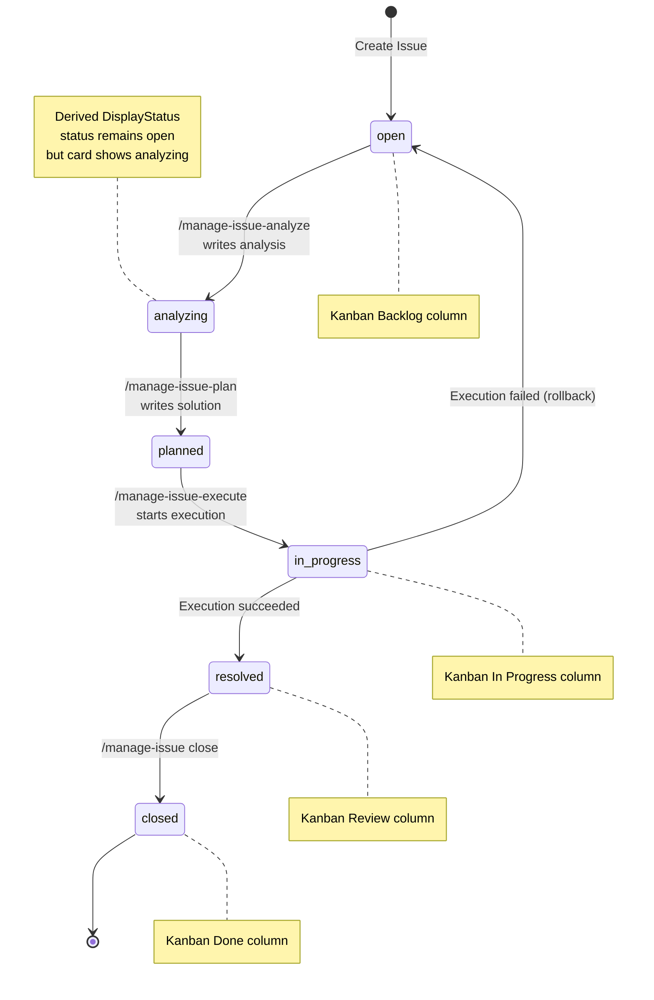
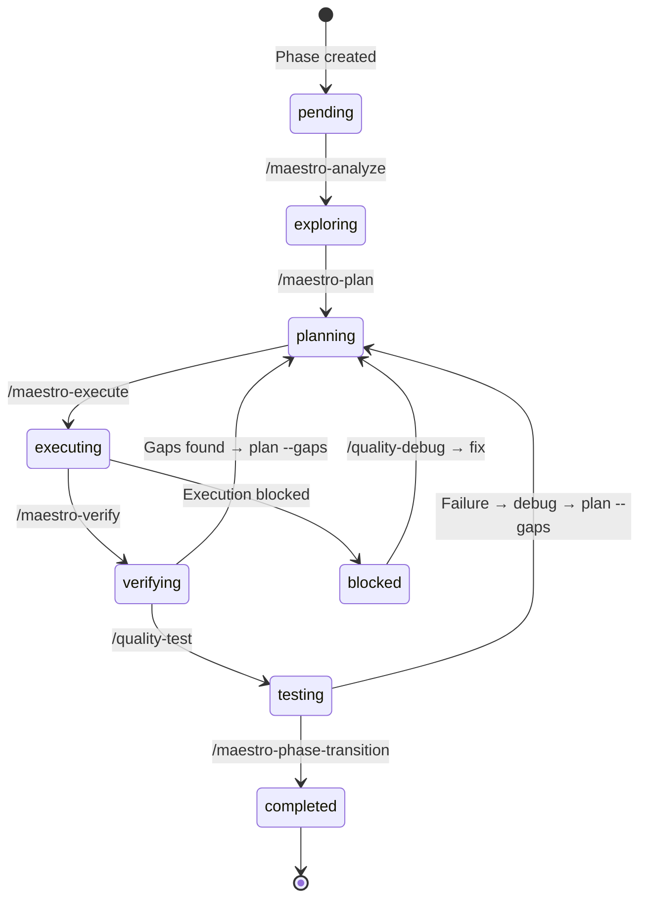
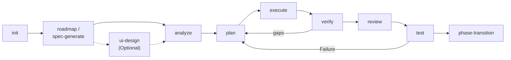
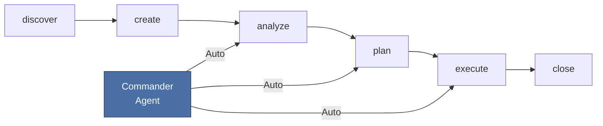
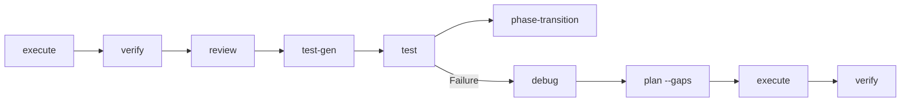
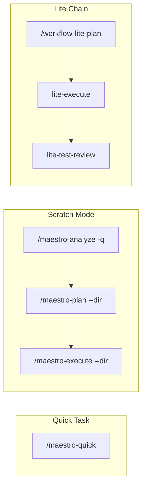

# Maestro-Flow Command Usage Guide

The Maestro-Flow command system includes 36 slash commands, organized into 4 major categories. This document covers the main pipeline command sequencing, quick channels, the Issue closed-loop workflow, and the usage scenarios for each command.

## Command Overview

| Category | Count | Prefix | Responsibility |
|----------|-------|--------|----------------|
| **Core Workflow** | 15 | `maestro-*` | Project initialization, planning, execution, verification, phase progression |
| **Management** | 9 | `manage-*` | Issue management, codebase documentation, memory, status |
| **Quality** | 7 | `quality-*` | Code review, testing, debugging, refactoring, sync |
| **Specification** | 4 | `spec-*` | Project spec initialization, loading, mapping, entry |

The global entry point `/maestro` is the smart coordinator that automatically selects the optimal command chain based on user intent and project state.

### Command Panorama



### Interaction Between Main Pipeline and Issues



> **Key relationship overview**: The Phase pipeline and Issue closed-loop are two parallel workflows interconnected through the following mechanisms:
>
> 1. **Phase to Issue (problem production)**: `quality-review` automatically creates Issues for critical/high severity findings during code review; `quality-test` produces Issues on failure; `maestro-verify` can associate Issues when gaps are found
> 2. **Issue to Phase (fix injection)**: Issues link to specific Phases via the `phase_id` field, with `path=workflow` indicating the Issue belongs to the Phase pipeline context; code modified during Issue execution serves the owning Phase
> 3. **Commander bidirectional orchestration**: Commander Agent manages both Phase task scheduling (via ExecutionScheduler) and Issue closed-loop advancement (via AgentManager), forming a unified automation scheduling layer
> 4. **Shared storage**: Both workflows share `issues.jsonl` storage and WebSocket real-time communication

### Two Issue Processing Paths

The Issue `path` field distinguishes two processing paths:

| path | Meaning | Source | Lifecycle |
|------|---------|--------|-----------|
| `standalone` | Independent Issue, not bound to a Phase | Manual creation, `/manage-issue-discover`, external import | Independent closed-loop, does not affect Phase progression |
| `workflow` | Phase-linked Issue | `quality-review` auto-create, Phase verification output | May block Phase transition |

- `standalone` Issues are displayed independently on the kanban board, resolved through the Issue closed-loop (analyze, plan, execute)
- `workflow` Issues carry a `phase_id` and are displayed alongside their corresponding Phase column on the kanban board; their resolution status may affect whether the Phase can transition

```mermaid
graph LR
    subgraph standalone_path["standalone path"]
        S1["Manual create /<br>discover found"] --> S2["Independent closed-loop<br>analyze→plan→execute"]
        S2 --> S3["close"]
    end

    subgraph workflow_path["workflow path"]
        W1["review/verify/test<br>auto-create"] --> W2["Link to Phase N<br>phase_id=N"]
        W2 --> W3["Issue closed-loop fix"]
        W3 --> W4["Phase re-verification"]
        W4 --> W5["phase-transition"]
    end

    style standalone_path fill:#1a1a2e,stroke:#4a4a6a
    style workflow_path fill:#1a2e1a,stroke:#4a6a4a
```



### Issue Closed-Loop State Transitions



### Main Phase State Machine



---

## 1. Main Workflow (Phase Pipeline)

The main workflow progresses the project in units of **Phase**, with each Phase going through a complete lifecycle pipeline.

### 1.1 Project Initialization

```
/maestro-init → /maestro-roadmap or /maestro-spec-generate
```

| Step | Command | Purpose | Output |
|------|---------|---------|--------|
| 0 | `/maestro-brainstorm` (optional) | Multi-role brainstorming | guidance-specification.md |
| 1 | `/maestro-init` | Initialize .workflow/ directory | state.json, project.md, specs/ |
| 2a | `/maestro-roadmap` | Lightweight roadmap (interactive) | roadmap.md + phases/ directory |
| 2b | `/maestro-spec-generate` | Full specification chain (7 stages) | PRD + architecture docs + roadmap.md |
| (optional) | `/maestro-ui-design` | UI design prototype | design-ref/ tokens |

**Choosing 2a vs 2b**: Use roadmap for small projects or when requirements are clear; use spec-generate for large projects or when complete specification documents are needed.

### 1.2 Phase Pipeline (executed cyclically for each Phase)

```
/maestro-analyze → /maestro-plan → /maestro-execute → /maestro-verify → /quality-review → /quality-test → /maestro-phase-transition
```

| Stage | Command | Input | Output | Dashboard Status |
|-------|---------|-------|--------|-----------------|
| Explore | `/maestro-analyze {N}` | phase directory | context.md, analysis.md | `pending` → `exploring` |
| Plan | `/maestro-plan {N}` | context.md | plan.json + TASK-*.json | `exploring` → `planning` |
| Execute | `/maestro-execute {N}` | plan.json | .summaries/, code changes | `planning` → `executing` |
| Verify | `/maestro-verify {N}` | .summaries/ | verification.json | `executing` → `verifying` |
| Review | `/quality-review {N}` | code changes | review.json | `verifying` |
| Test | `/quality-test {N}` | verification.json | uat.md | `verifying` → `testing` |
| Advance | `/maestro-phase-transition` | all passed | next phase initialization | `testing` → `completed` |

### 1.3 Gap Fix Loop

When verification or testing finds gaps:

```
/maestro-verify (gaps found) → /maestro-plan --gaps → /maestro-execute → /maestro-verify (re-check)
/quality-test --auto-fix (failure) → /quality-debug → /maestro-plan --gaps → re-execute
```

### 1.4 Milestone Management

When all Phases of a milestone are completed:

```
/maestro-milestone-audit → /maestro-milestone-complete
```

- `milestone-audit`: Cross-Phase integration verification, checking inter-module dependencies and interface consistency
- `milestone-complete`: Archive the milestone and advance to the next one

### 1.5 Using the Maestro Coordinator

All of the above sequencing can be orchestrated automatically via `/maestro`:

```bash
/maestro "Implement user authentication module"          # Intent recognition → auto-select command chain
/maestro continue                    # Auto-execute next step based on state.json
/maestro -y "Add OAuth support"        # Fully automatic mode (skip all interactive confirmations)
/maestro --chain full-lifecycle      # Force use of the full lifecycle chain
/maestro status                      # Quick view of project status
```

**Available command chains**:

| Chain Name | Command Sequence | Use Case |
|------------|------------------|----------|
| `full-lifecycle` | init→spec-generate→plan→execute→verify→review→test→transition | Brand new project |
| `spec-driven` | init→spec-generate→... | Requires full specification |
| `roadmap-driven` | init→roadmap→... | Lightweight roadmap |
| `brainstorm-driven` | brainstorm→init→roadmap→... | Start from brainstorming |
| `ui-design-driven` | ui-design→plan→execute→verify | UI design driven |
| `analyze-plan-execute` | analyze→plan→execute | Quick analyze-plan-execute |
| `execute-verify` | execute→verify | Plan already exists, execute directly |
| `quality-loop` | review→test→debug | Quality pipeline |
| `milestone-close` | milestone-audit→milestone-complete | Close a milestone |
| `quick` | quick task | Instant small tasks |

---

## 2. Quick Channel (Scratch Mode)

Bypasses the Phase pipeline and completes tasks directly in a scratch directory.

### 2.1 Quick Tasks

```bash
/maestro-quick "Fix login page bug"              # Shortest path, skip optional agents
/maestro-quick --full "Refactor API layer"            # With plan-checker validation
/maestro-quick --discuss "Database migration strategy"       # With decision extraction (Locked/Free/Deferred)
```

Output is stored in `.workflow/scratch/{task-slug}/`, without affecting the main Phase pipeline.

### 2.2 Quick Analyze + Plan + Execute

```bash
/maestro-analyze -q "Performance optimization"    # Quick mode, decision extraction only → generates context.md
/maestro-plan --dir .workflow/scratch/xxx   # Plan against scratch directory
/maestro-execute --dir .workflow/scratch/xxx  # Execute against scratch directory
```

The `--dir` parameter skips roadmap validation and works directly in the specified directory.

### 2.3 Lite Plan Workflow (Skill Level)

A lighter plan-execute chain via the Skill system's `workflow-lite-plan`:

```bash
/workflow-lite-plan "Implement Issue closed-loop system"    # explore→clarify→plan→confirm→execute→test-review
```

Automatic chaining: `lite-plan → lite-execute → lite-test-review`, managed entirely under `.workflow/.lite-plan/`.

---

## 3. Issue Closed-Loop Workflow

The Issue system runs in parallel with the Phase pipeline. It can operate as an independent closed-loop or deeply integrate with Phases.

**Relationship with the main pipeline** (see "Interaction Between Main Pipeline and Issues" in the Command Panorama):
- **Phase produces Issues**: `quality-review` automatically creates Issues for critical/high findings during review (auto-issue creation); `quality-test` creates Issues on failure; gaps from `maestro-verify` can also be converted to Issues
- **Issue fixes inject back into Phase**: Issues with `phase_id` (`path=workflow`) serve the Phase after fix execution; re-verify and re-test are required before transition
- **Standalone Issues do not block Phases**: `path=standalone` Issues are resolved through the Issue closed-loop independently, without affecting Phase progression
- **Commander unified scheduling**: Commander Agent drives both Phase tasks and Issue closed-loop, auto-scheduling with priority order `execute > analyze > plan`

### 3.1 Issue Lifecycle

```
Discover → Create → Analyze → Plan → Execute → Close
```

```
/manage-issue-discover                          # Auto-discover problems
       ↓
/manage-issue create --title "..." --severity high   # Create Issue
       ↓
/manage-issue-analyze ISS-xxx                   # Root cause analysis → writes analysis
       ↓
/manage-issue-plan ISS-xxx                      # Solution planning → writes solution
       ↓
/manage-issue-execute ISS-xxx                   # Execute solution → status change
       ↓
/manage-issue close ISS-xxx --resolution "fixed" # Close Issue
```

### 3.2 Command Details

#### `/manage-issue-discover` — Problem Discovery

Two modes:

```bash
/manage-issue-discover                        # Full 8-perspective scan (security/performance/reliability/maintainability/scalability/UX/accessibility/compliance)
/manage-issue-discover by-prompt "Check error handling in APIs" # Targeted discovery by prompt
```

Output: Deduplicated Issue list, automatically written to `issues.jsonl`.

#### `/manage-issue` — CRUD Operations

```bash
/manage-issue create --title "Memory leak" --severity high --source discovery
/manage-issue list --status open --severity high
/manage-issue status ISS-xxx
/manage-issue update ISS-xxx --priority urgent --tags "perf,memory"
/manage-issue close ISS-xxx --resolution "Fixed in commit abc123"
/manage-issue link ISS-xxx --task TASK-001      # Bidirectional link Issue ↔ Task
```

#### `/manage-issue-analyze` — Root Cause Analysis

```bash
/manage-issue-analyze ISS-xxx                   # Uses gemini by default
/manage-issue-analyze ISS-xxx --tool qwen --depth deep  # Specify tool and depth
```

Flow: Read Issue → CLI codebase exploration → Identify root cause → Write to `analysis` field (root_cause, impact, confidence, related_files, suggested_approach).

After analysis, the Issue's display status changes from `open` to `analyzing`.

#### `/manage-issue-plan` — Solution Planning

```bash
/manage-issue-plan ISS-xxx                      # Generate solution based on analysis
/manage-issue-plan ISS-xxx --from-analysis       # Explicitly use analysis results
```

Flow: Read Issue + analysis → CLI planning → Generate executable steps → Write to `solution` field (steps[], context, planned_by).

After planning, the Issue's display status changes from `analyzing` to `planned`.

#### `/manage-issue-execute` — Solution Execution

```bash
/manage-issue-execute ISS-xxx                            # Default claude-code
/manage-issue-execute ISS-xxx --executor gemini           # Specify executor
/manage-issue-execute ISS-xxx --dry-run                   # Dry run (no actual execution)
```

**Dual-mode execution**:
- **Server UP**: Dispatched via Dashboard API (`POST /api/execution/dispatch`)
- **Server DOWN**: Executed directly via `maestro cli`

### 3.3 Issue and Kanban Integration

How Issues appear on the Dashboard kanban board:

| Issue Status | Kanban Column | Display Status | Card Features |
|-------------|---------------|----------------|---------------|
| `open` (no analysis) | Backlog | `open` (gray) | Type + priority badge |
| `open` + analysis | Backlog | `analyzing` (blue) | + analysis marker |
| `open` + solution | Backlog | `planned` (purple) | + "N steps" indicator |
| `in_progress` | In Progress | `in_progress` (yellow) | + execution status animation |
| `resolved` | Review | `resolved` (green) | Completion marker |
| `closed` | Done | `closed` (gray) | Archived |

The **path badge** on IssueCard identifies the Issue source:
- `standalone` — Independent Issue (manually created or discovered)
- `workflow` — Phase-linked Issue (auto-created by review/verify/test, with `phase_id`)

Available actions on the kanban board:
- **Analyze/Plan/Execute buttons** → Click in Issue detail modal, triggers backend Agent via WebSocket
- **Executor selector** → Hover on IssueCard to display, choose Claude/Codex/Gemini
- **Batch execution** → Multi-select Issues then use ExecutionToolbar

### 3.4 Commander Agent Automation

Commander Agent acts as an autonomous supervisor that can automatically advance the Issue closed-loop without manual intervention:

1. Finds `open` Issues without `analysis` → auto-triggers `analyze_issue`
2. Finds Issues with `analysis` but no `solution` → auto-triggers `plan_issue`
3. Executes in priority order: `execute > analyze > plan`

This means Issues can be fully automated through the analyze, plan, execute closed-loop by Commander after creation.

---

## 4. Quality Pipeline

Quality commands typically run after Phase execution, but can also be used independently.

### 4.1 Standard Quality Flow

```
/maestro-execute → /maestro-verify → /quality-review → /quality-test-gen → /quality-test → /maestro-phase-transition
```

### 4.2 Command Descriptions

| Command | Purpose | Parameters | Typical Scenario |
|---------|---------|------------|------------------|
| `/quality-review {N}` | Tiered code review | `--level quick\|standard\|deep` | Review code quality after execution |
| `/quality-test-gen {N}` | Test generation | `--layer unit\|e2e\|all` | Nyquist coverage analysis + RED-GREEN |
| `/quality-test {N}` | Session-based UAT | `--smoke` `--auto-fix` | Acceptance testing + auto-fix loop |
| `/quality-debug` | Hypothesis-driven debugging | `--from-uat {N}` `--parallel` | Root cause analysis after test failure |
| `/quality-integration-test {N}` | Integration testing | `--max-iter N` `--layer L0-L3` | L0-L3 progressive integration testing |
| `/quality-refactor` | Technical debt remediation | `[scope]` | Reflection-driven refactoring iteration |
| `/quality-sync` | Documentation sync | `--since HEAD~N` | Sync documentation after code changes |

### 4.3 Debug Loop

```
/quality-test (failure found) → /quality-debug --from-uat {N} → fix → /quality-test (re-verify)
```

`quality-debug` supports parallel hypothesis verification (`--parallel`), using the scientific method (hypothesis, experiment, verification) for root cause analysis.

---

## 5. Specification and Knowledge Management

### 5.1 Specification Management

```bash
/spec-setup                          # Initialize specs/ (scan project to generate conventions)
/spec-map                            # 4 parallel mapper agents analyze the codebase
/spec-add decision "Use JSONL format for Issue storage"  # Record a design decision
/spec-add pattern "All API endpoints use the Hono framework"  # Record a code pattern
/spec-load --category planning       # Load planning-related specs (called before agent execution)
```

Types: `bug` / `pattern` / `decision` / `rule` / `debug` / `test` / `review` / `validation`

### 5.2 Codebase Documentation

```bash
/manage-codebase-rebuild             # Full rebuild of .workflow/codebase/ docs
/manage-codebase-refresh             # Incremental refresh (based on git diff)
```

### 5.3 Memory Management

```bash
/manage-memory-capture compact       # Compact current session memory
/manage-memory-capture tip "Always use bun instead of npm" --tag tooling
/manage-memory list --store workflow --tag tooling
/manage-memory search "authentication"
```

### 5.4 Status View

```bash
/manage-status                       # Project dashboard (progress, active tasks, next step suggestions)
```

---

## 6. Command Sequencing Quick Reference

### Main Phase Pipeline



### Issue Closed-Loop



### Quality Pipeline



### Quick Channel



---

## 7. Common Workflow Examples

### New Project from Scratch

```bash
/maestro-brainstorm "Online education platform"
/maestro-init --from-brainstorm ANL-xxx
/maestro-roadmap "Create roadmap based on brainstorm results" -y
/maestro-plan 1
/maestro-execute 1
/maestro-verify 1
/maestro-phase-transition
```

### One-Click Fully Automatic

```bash
/maestro -y "Implement user authentication system"
# Auto-executes: init → roadmap → plan → execute → verify → review → test → transition
```

### Discover and Fix Problems

```bash
/manage-issue-discover by-prompt "Check error handling in all API endpoints"
/manage-issue-analyze ISS-xxx
/manage-issue-plan ISS-xxx
/manage-issue-execute ISS-xxx --executor gemini
/manage-issue close ISS-xxx --resolution "Fixed"
```

### Quick Fix a Bug

```bash
/maestro-quick "Fix login page layout issues on mobile"
```

### Test Failure After Phase Execution

```bash
/quality-test 3                     # 2 failures found
/quality-debug --from-uat 3         # Auto-diagnose root cause
/maestro-plan 3 --gaps              # Generate fix plan
/maestro-execute 3                  # Execute fix
/quality-test 3                     # Re-verify
/maestro-phase-transition           # Advance after passing
```
