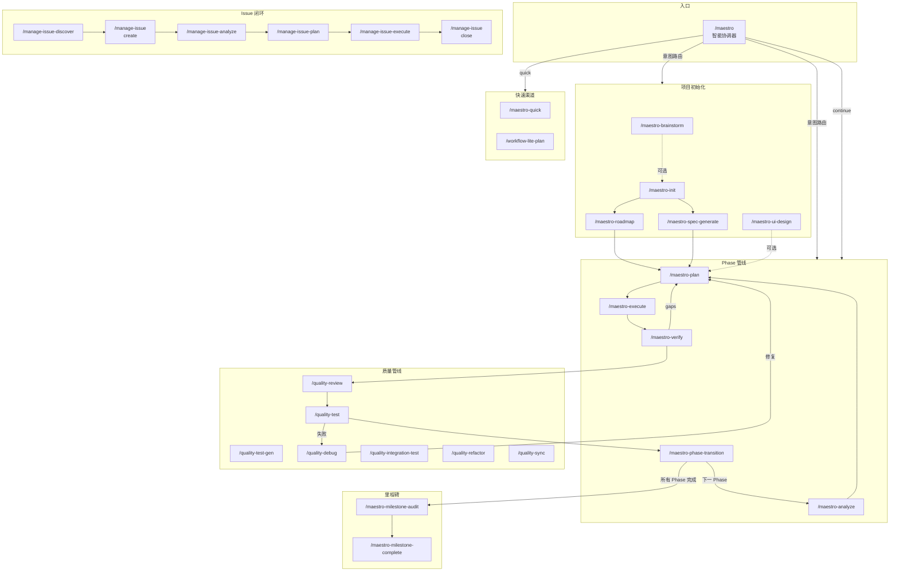
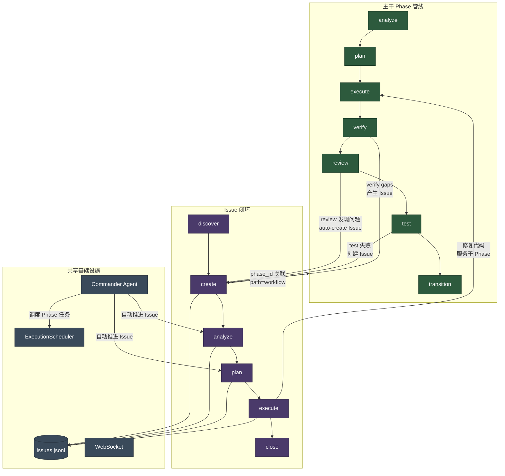
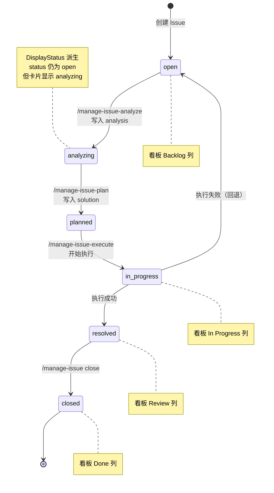
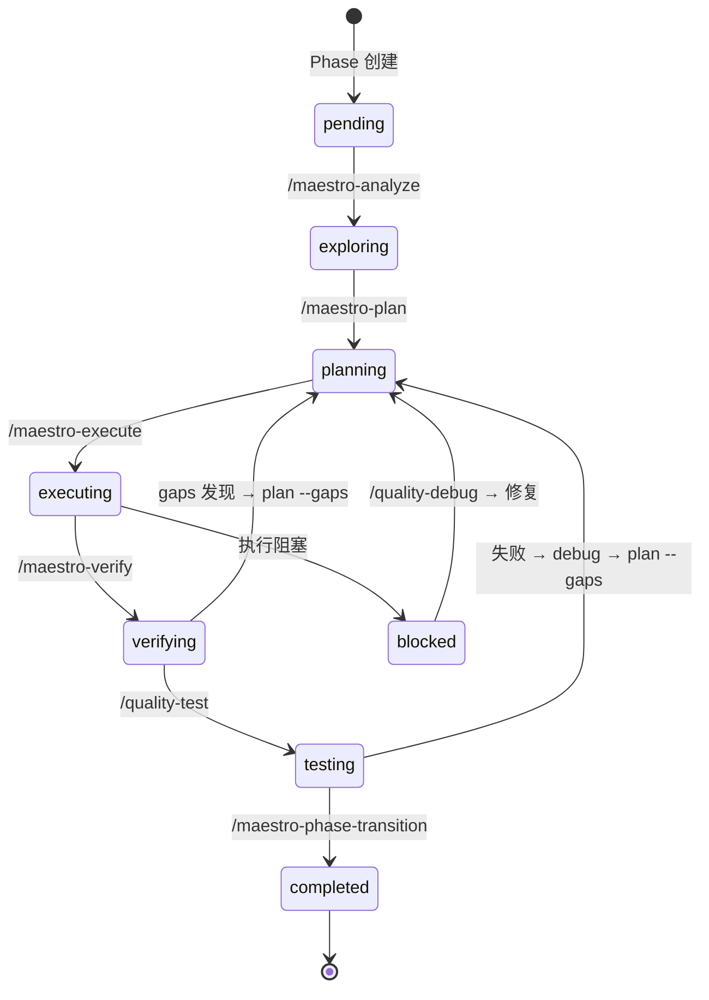
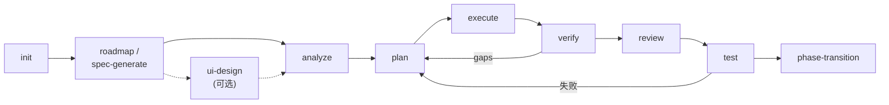
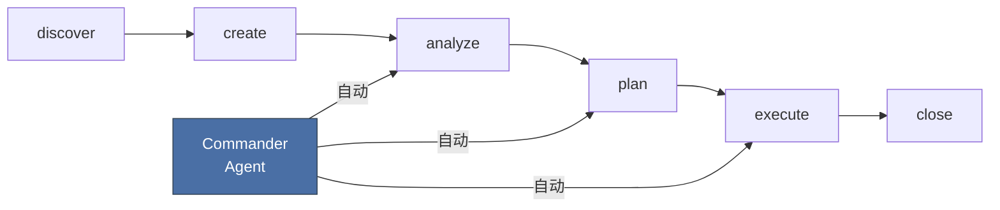
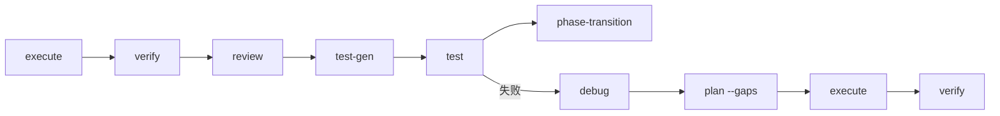
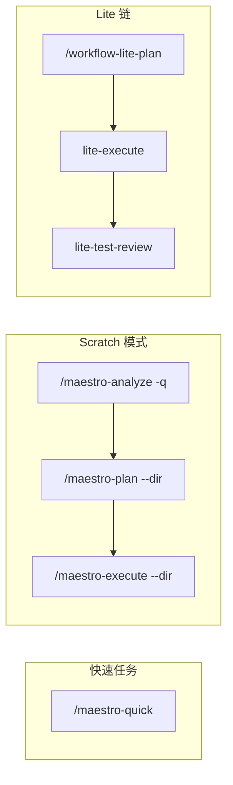

# Maestro 命令使用指南

Maestro 命令系统包含 36 个 slash 命令，分为 4 大类。本文档说明主干工作流的命令衔接、快速渠道、Issue 闭环工作流，以及各命令的使用场景。

## 命令总览

| 类别 | 命令数 | 前缀 | 职责 |
|------|--------|------|------|
| **核心工作流** | 15 | `maestro-*` | 项目初始化、规划、执行、验证、阶段推进 |
| **管理** | 9 | `manage-*` | Issue 管理、代码库文档、内存、状态 |
| **质量** | 7 | `quality-*` | 代码审查、测试、调试、重构、同步 |
| **规范** | 4 | `spec-*` | 项目规范初始化、加载、映射、录入 |

全局入口 `/maestro` 是智能协调器，根据用户意图和项目状态自动选择最优命令链。

### 命令全景图



### 主干与 Issue 的交互关系



> **核心关系说明**：Phase 管线和 Issue 闭环是两条并行的工作流，通过以下机制互联：
>
> 1. **Phase → Issue（问题产出）**：`quality-review` 审查代码时自动为 critical/high 级别发现创建 Issue；`quality-test` 失败时产生 Issue；`maestro-verify` 发现 gap 时可关联 Issue
> 2. **Issue → Phase（修复回注）**：Issue 通过 `phase_id` 字段关联到具体 Phase，`path=workflow` 标识该 Issue 属于 Phase 管线上下文；Issue 的 execute 修改的代码服务于所属 Phase
> 3. **Commander 双向驱动**：Commander Agent 同时管理 Phase 任务调度（通过 ExecutionScheduler）和 Issue 闭环推进（通过 AgentManager），形成统一的自动化调度层
> 4. **共享存储**：两条工作流共用 `issues.jsonl` 存储和 WebSocket 实时通信

### Issue 两种处理路径

Issue 的 `path` 字段区分两种处理路径：

| path | 含义 | 来源 | 生命周期 |
|------|------|------|----------|
| `standalone` | 独立 Issue，不绑定 Phase | 手动创建、`/manage-issue-discover`、外部导入 | 独立闭环，不影响 Phase 推进 |
| `workflow` | Phase 关联 Issue | `quality-review` auto-create、Phase 验证产生 | 可能阻塞 Phase transition |

- `standalone` Issue 在看板上独立显示，通过 Issue 闭环（analyze→plan→execute）自行解决
- `workflow` Issue 带有 `phase_id`，在看板中与对应 Phase 同列展示，其解决状态可能影响 Phase 是否可以 transition

```mermaid
graph LR
    subgraph standalone_path["standalone 路径"]
        S1["手动创建 /<br>discover 发现"] --> S2["独立闭环<br>analyze→plan→execute"]
        S2 --> S3["close"]
    end

    subgraph workflow_path["workflow 路径"]
        W1["review/verify/test<br>自动创建"] --> W2["关联 Phase N<br>phase_id=N"]
        W2 --> W3["Issue 闭环修复"]
        W3 --> W4["Phase 重新验证"]
        W4 --> W5["phase-transition"]
    end

    style standalone_path fill:#1a1a2e,stroke:#4a4a6a
    style workflow_path fill:#1a2e1a,stroke:#4a6a4a
```



### Issue 闭环状态流转



### 主干 Phase 状态机



---

## 一、主干工作流（Phase Pipeline）

主干工作流以 **Phase**（阶段）为单位推进项目，每个 Phase 经历完整的生命周期管线。

### 1.1 项目初始化

```
/maestro-init → /maestro-roadmap 或 /maestro-spec-generate
```

| 步骤 | 命令 | 作用 | 产出 |
|------|------|------|------|
| 0 | `/maestro-brainstorm` (可选) | 多角色头脑风暴 | guidance-specification.md |
| 1 | `/maestro-init` | 初始化 .workflow/ 目录 | state.json, project.md, specs/ |
| 2a | `/maestro-roadmap` | 轻量路线图（交互式） | roadmap.md + phases/ 目录 |
| 2b | `/maestro-spec-generate` | 完整规范链（7 阶段） | PRD + 架构文档 + roadmap.md |
| (可选) | `/maestro-ui-design` | UI 设计原型 | design-ref/ tokens |

**选择 2a 还是 2b**：小型项目或需求明确时用 roadmap；大型项目或需要完整规范文档时用 spec-generate。

### 1.2 阶段管线（每个 Phase 循环执行）

```
/maestro-analyze → /maestro-plan → /maestro-execute → /maestro-verify → /quality-review → /quality-test → /maestro-phase-transition
```

| 阶段 | 命令 | 输入 | 产出 | Dashboard 状态 |
|------|------|------|------|----------------|
| 探索 | `/maestro-analyze {N}` | phase 目录 | context.md, analysis.md | `pending` → `exploring` |
| 规划 | `/maestro-plan {N}` | context.md | plan.json + TASK-*.json | `exploring` → `planning` |
| 执行 | `/maestro-execute {N}` | plan.json | .summaries/, 代码变更 | `planning` → `executing` |
| 验证 | `/maestro-verify {N}` | .summaries/ | verification.json | `executing` → `verifying` |
| 审查 | `/quality-review {N}` | 代码变更 | review.json | `verifying` |
| 测试 | `/quality-test {N}` | verification.json | uat.md | `verifying` → `testing` |
| 推进 | `/maestro-phase-transition` | 全部通过 | 下一 phase 初始化 | `testing` → `completed` |

### 1.3 Gap 修复循环

当验证或测试发现缺口时：

```
/maestro-verify (发现 gaps) → /maestro-plan --gaps → /maestro-execute → /maestro-verify (重新检查)
/quality-test --auto-fix (失败) → /quality-debug → /maestro-plan --gaps → 重新执行
```

### 1.4 里程碑管理

当一个里程碑的所有 Phase 都完成后：

```
/maestro-milestone-audit → /maestro-milestone-complete
```

- `milestone-audit`: 跨 Phase 集成验证，检查模块间依赖和接口一致性
- `milestone-complete`: 归档里程碑，删除旧 roadmap.md，重置状态，推进到下一个里程碑
- 归档后运行 `/maestro continue` → 协调器检测 post-milestone 状态，自动加载 deferred items 并启动新 roadmap 规划

### 1.5 使用 Maestro 协调器

上述所有衔接可通过 `/maestro` 自动编排：

```bash
/maestro "实现用户认证模块"          # 意图识别 → 自动选择命令链
/maestro continue                    # 基于 state.json 自动执行下一步
/maestro -y "添加 OAuth 支持"        # 全自动模式（跳过所有交互确认）
/maestro --chain full-lifecycle      # 强制使用完整生命周期链
/maestro status                      # 快捷查看项目状态
```

**可用命令链**:

| 链名 | 命令序列 | 适用场景 |
|------|----------|----------|
| `full-lifecycle` | init→spec-generate→plan→execute→verify→review→test→transition | 全新项目 |
| `spec-driven` | init→spec-generate→... | 需要完整规范 |
| `roadmap-driven` | init→roadmap→... | 轻量路线图 |
| `brainstorm-driven` | brainstorm→init→roadmap→... | 从头脑风暴开始 |
| `ui-design-driven` | ui-design→plan→execute→verify | UI 设计驱动 |
| `analyze-plan-execute` | analyze→plan→execute | 快速分析-规划-执行 |
| `execute-verify` | execute→verify | 已有计划，直接执行 |
| `quality-loop` | review→test→debug | 质量流水线 |
| `milestone-close` | milestone-audit→milestone-complete | 关闭里程碑 |
| `next-milestone` | maestro-roadmap→plan→execute→verify | 启动下一里程碑（自动加载 deferred items） |
| `quick` | quick task | 即时小任务 |

---

## 二、快速渠道（Scratch Mode）

不走 Phase 管线，直接在 scratch 目录中完成任务。

### 2.1 快速任务

```bash
/maestro-quick "修复登录页面 bug"              # 最短路径，跳过可选 agent
/maestro-quick --full "重构 API 层"            # 带 plan-checker 验证
/maestro-quick --discuss "数据库迁移方案"       # 带决策提取（Locked/Free/Deferred）
```

产出存放在 `.workflow/scratch/{task-slug}/`，不影响主干 Phase。

### 2.2 快速分析 + 规划 + 执行

```bash
/maestro-analyze -q "性能优化"    # Quick 模式，仅决策提取 → 生成 context.md
/maestro-plan --dir .workflow/scratch/xxx   # 对 scratch 目录规划
/maestro-execute --dir .workflow/scratch/xxx  # 对 scratch 目录执行
```

`--dir` 参数跳过路线图验证，直接在指定目录工作。

### 2.3 Lite Plan 工作流（技能级别）

通过 Skill 系统的 `workflow-lite-plan` 实现更轻量的规划-执行链：

```bash
/workflow-lite-plan "实现 Issue 闭环系统"    # 探索→澄清→规划→确认→执行→测试审查
```

自动链接：`lite-plan → lite-execute → lite-test-review`，全程在 `.workflow/.lite-plan/` 下管理。

---

## 三、Issue 闭环工作流

Issue 系统与 Phase 管线并行运行，既可独立闭环，也可与 Phase 深度联动。

**与主干的关系**（详见命令全景图中的"主干与 Issue 的交互关系"）：
- **Phase 产出 Issue**：`quality-review` 在审查时自动为 critical/high 发现创建 Issue（auto-issue creation）；`quality-test` 失败时创建 Issue；`maestro-verify` 的 gap 也可转化为 Issue
- **Issue 修复回注 Phase**：带 `phase_id` 的 Issue（`path=workflow`）执行修复后，代码变更服务于该 Phase，需重新 verify 和 test 才能 transition
- **独立 Issue 不阻塞 Phase**：`path=standalone` 的 Issue 通过 Issue 闭环自行解决，不影响 Phase 推进
- **Commander 统一调度**：Commander Agent 同时驱动 Phase 任务和 Issue 闭环，按 `execute > analyze > plan` 优先级自动调度

### 3.1 Issue 生命周期

```
发现 → 创建 → 分析 → 规划 → 执行 → 关闭
```

```
/manage-issue-discover                          # 自动发现问题
       ↓
/manage-issue create --title "..." --severity high   # 创建 Issue
       ↓
/manage-issue-analyze ISS-xxx                   # 根因分析 → 写入 analysis
       ↓
/manage-issue-plan ISS-xxx                      # 解决方案 → 写入 solution
       ↓
/manage-issue-execute ISS-xxx                   # 执行方案 → 状态变更
       ↓
/manage-issue close ISS-xxx --resolution "fixed" # 关闭 Issue
```

### 3.2 各命令详解

#### `/manage-issue-discover` — 问题发现

两种模式：

```bash
/manage-issue-discover                        # 8 视角全扫描（安全/性能/可靠性/可维护/可扩展/UX/可访问/合规）
/manage-issue-discover by-prompt "检查 API 的错误处理" # 按提示词定向发现
```

产出：去重后的 Issue 列表，自动写入 `issues.jsonl`。

#### `/manage-issue` — CRUD 操作

```bash
/manage-issue create --title "内存泄漏" --severity high --source discovery
/manage-issue list --status open --severity high
/manage-issue status ISS-xxx
/manage-issue update ISS-xxx --priority urgent --tags "perf,memory"
/manage-issue close ISS-xxx --resolution "Fixed in commit abc123"
/manage-issue link ISS-xxx --task TASK-001      # 双向关联 Issue ↔ Task
```

#### `/manage-issue-analyze` — 根因分析

```bash
/manage-issue-analyze ISS-xxx                   # 默认使用 gemini
/manage-issue-analyze ISS-xxx --tool qwen --depth deep  # 指定工具和深度
```

流程：读取 Issue → CLI 探索代码库 → 识别根因 → 写入 `analysis` 字段（root_cause, impact, confidence, related_files, suggested_approach）。

分析完成后 Issue 的显示状态从 `open` 变为 `analyzing`。

#### `/manage-issue-plan` — 方案规划

```bash
/manage-issue-plan ISS-xxx                      # 基于 analysis 生成方案
/manage-issue-plan ISS-xxx --from-analysis       # 显式使用分析结果
```

流程：读取 Issue + analysis → CLI 规划 → 生成可执行步骤 → 写入 `solution` 字段（steps[], context, planned_by）。

规划完成后 Issue 的显示状态从 `analyzing` 变为 `planned`。

#### `/manage-issue-execute` — 方案执行

```bash
/manage-issue-execute ISS-xxx                            # 默认 claude-code
/manage-issue-execute ISS-xxx --executor gemini           # 指定执行器
/manage-issue-execute ISS-xxx --dry-run                   # 干跑（不实际执行）
```

**双模式执行**：
- **Server UP**: 通过 Dashboard API (`POST /api/execution/dispatch`) 调度
- **Server DOWN**: 通过 `ccw cli` 直接执行

### 3.3 Issue 与看板集成

Issue 在 Dashboard 看板中的呈现方式：

| Issue Status | 看板列 | 显示状态 | 卡片特征 |
|-------------|--------|----------|----------|
| `open` (无 analysis) | Backlog | `open` (灰色) | 类型+优先级徽标 |
| `open` + analysis | Backlog | `analyzing` (蓝色) | + 分析标记 |
| `open` + solution | Backlog | `planned` (紫色) | + "N steps" 指示器 |
| `in_progress` | In Progress | `in_progress` (黄色) | + 执行状态动画 |
| `resolved` | Review | `resolved` (绿色) | 完成标记 |
| `closed` | Done | `closed` (灰色) | 归档 |

IssueCard 上的 **path 徽标** 标识 Issue 来源：
- `standalone` — 独立 Issue（手动创建或 discover 发现）
- `workflow` — Phase 关联 Issue（review/verify/test 自动创建，带 `phase_id`）

看板中可直接操作：
- **Analyze/Plan/Execute 按钮** → 在 Issue 详情弹窗中点击，通过 WebSocket 触发后端 Agent
- **执行器选择器** → 在 IssueCard 上 hover 显示，选择 Claude/Codex/Gemini
- **批量执行** → 多选 Issue 后使用 ExecutionToolbar

### 3.4 Commander Agent 自动化

Commander Agent 作为自主 supervisor 可自动推进 Issue 闭环，无需手动干预：

1. 发现 `open` 且无 `analysis` 的 Issue → 自动触发 `analyze_issue`
2. 发现有 `analysis` 无 `solution` 的 Issue → 自动触发 `plan_issue`
3. 按优先级排序执行：`execute > analyze > plan`

这意味着 Issue 可以在创建后由 Commander 全自动完成 分析→规划→执行 的闭环。

---

## 四、质量管线

质量命令通常在 Phase 执行后运行，也可独立使用。

### 4.1 标准质量流程

```
/maestro-execute → /maestro-verify → /quality-review → /quality-test-gen → /quality-test → /maestro-phase-transition
```

### 4.2 各命令说明

| 命令 | 用途 | 参数 | 典型场景 |
|------|------|------|----------|
| `/quality-review {N}` | 分层代码审查 | `--level quick\|standard\|deep` | 执行后审查代码质量 |
| `/quality-test-gen {N}` | 测试生成 | `--layer unit\|e2e\|all` | Nyquist 覆盖率分析 + RED-GREEN |
| `/quality-test {N}` | 会话式 UAT | `--smoke` `--auto-fix` | 验收测试 + 自动修复循环 |
| `/quality-debug` | 假设驱动调试 | `--from-uat {N}` `--parallel` | 测试失败后根因分析 |
| `/quality-integration-test {N}` | 集成测试 | `--max-iter N` `--layer L0-L3` | L0-L3 渐进式集成测试 |
| `/quality-refactor` | 技术债务治理 | `[scope]` | 反思驱动的重构迭代 |
| `/quality-sync` | 文档同步 | `--since HEAD~N` | 代码变更后同步文档 |

### 4.3 调试闭环

```
/quality-test (发现失败) → /quality-debug --from-uat {N} → 修复 → /quality-test (重新验证)
```

`quality-debug` 支持并行假设验证（`--parallel`），使用科学方法（假设→实验→验证）进行根因分析。

---

## 五、规范与知识管理

### 5.1 规范管理

```bash
/spec-setup                          # 初始化 specs/（扫描项目生成约定）
/spec-map                            # 4 个并行 mapper agent 分析代码库
/spec-add decision "使用 JSONL 格式存储 Issue"  # 录入设计决策
/spec-add pattern "所有 API 端点使用 Hono 框架"  # 录入代码模式
/spec-load --category planning       # 加载规划相关规范（agent 执行前调用）
```

类型：`bug` / `pattern` / `decision` / `rule` / `debug` / `test` / `review` / `validation`

### 5.2 代码库文档

```bash
/manage-codebase-rebuild             # 全量重建 .workflow/codebase/ 文档
/manage-codebase-refresh             # 增量刷新（基于 git diff）
```

### 5.3 内存管理

```bash
/manage-memory-capture compact       # 压缩当前会话记忆
/manage-memory-capture tip "总是用 bun 而不是 npm" --tag tooling
/manage-memory list --store workflow --tag tooling
/manage-memory search "认证"
```

### 5.4 状态查看

```bash
/manage-status                       # 项目仪表板（进度、活跃任务、下一步建议）
```

---

## 六、命令衔接速查表

### 主干 Phase 管线



### Issue 闭环



### 质量管线



### 快速渠道



---

## 七、常用工作流示例

### 新项目从零开始

```bash
/maestro-brainstorm "在线教育平台"
/maestro-init --from-brainstorm ANL-xxx
/maestro-roadmap "基于头脑风暴结果创建路线图" -y
/maestro-plan 1
/maestro-execute 1
/maestro-verify 1
/maestro-phase-transition
```

### 一键全自动

```bash
/maestro -y "实现用户认证系统"
# 自动执行: init → roadmap → plan → execute → verify → review → test → transition
```

### 发现并修复问题

```bash
/manage-issue-discover by-prompt "检查所有 API 端点的错误处理"
/manage-issue-analyze ISS-xxx
/manage-issue-plan ISS-xxx
/manage-issue-execute ISS-xxx --executor gemini
/manage-issue close ISS-xxx --resolution "已修复"
```

### 快速修复一个 bug

```bash
/maestro-quick "修复登录页面在移动端的样式错乱"
```

### 阶段执行后发现测试失败

```bash
/quality-test 3                     # 发现 2 个失败
/quality-debug --from-uat 3         # 自动诊断根因
/maestro-plan 3 --gaps              # 生成修复计划
/maestro-execute 3                  # 执行修复
/quality-test 3                     # 重新验证
/maestro-phase-transition           # 通过后推进
```
